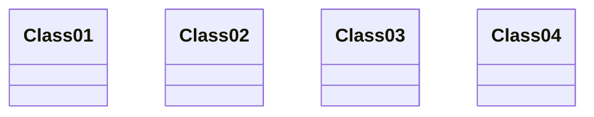

# test-mermaid

```mermaid
classDiagram
    class Class01
    class Class02
    callback Class01 "callbackFunction" "Callback tooltip"
    link Class02 "https://www.github.com" "This is a link"
    class Class03
    class Class04
    click Class03 call callbackFunction() "Callback tooltip"
    click Class04 href "https://www.github.com" "This is a link"
```

```mermaid
graph TD;
    A-->B;
    A-->C;
    B-->D;
    C-->D;
```
