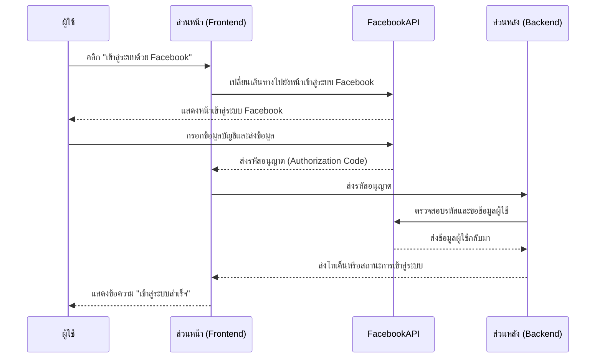
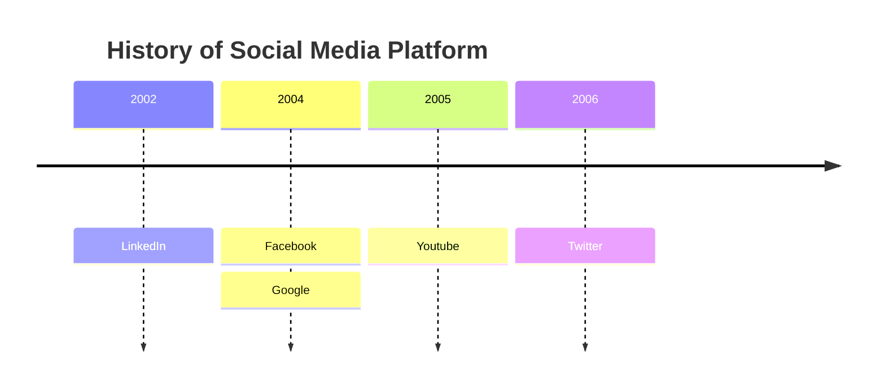
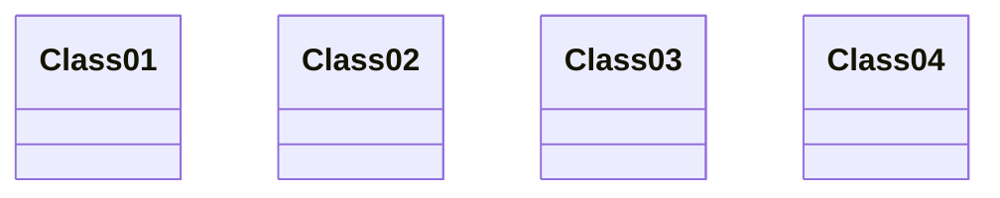
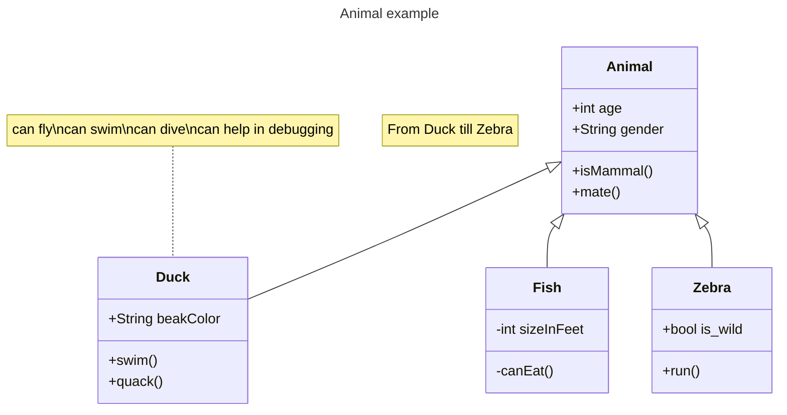
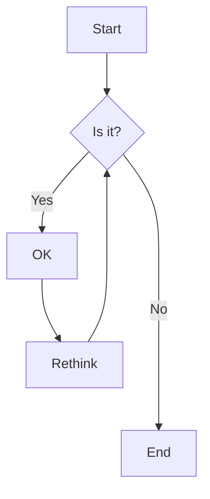
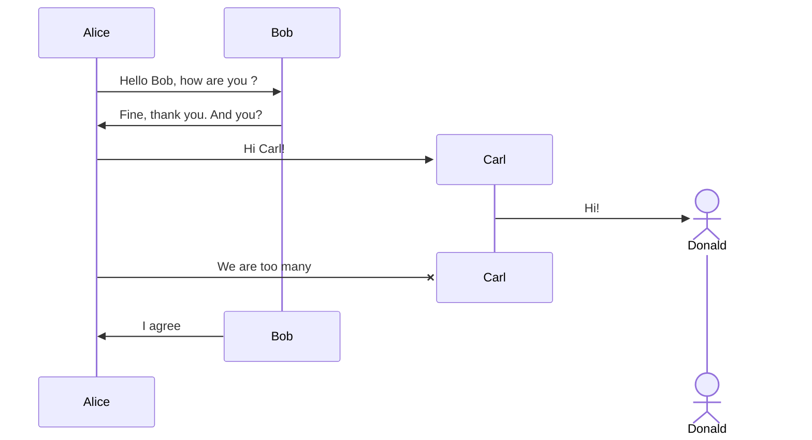
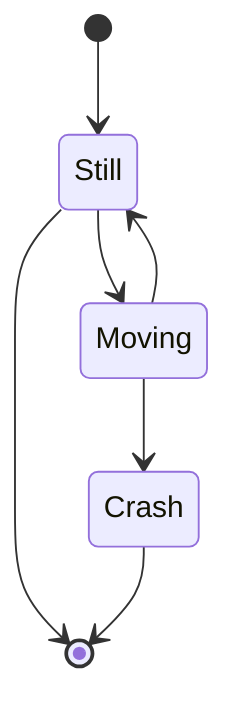
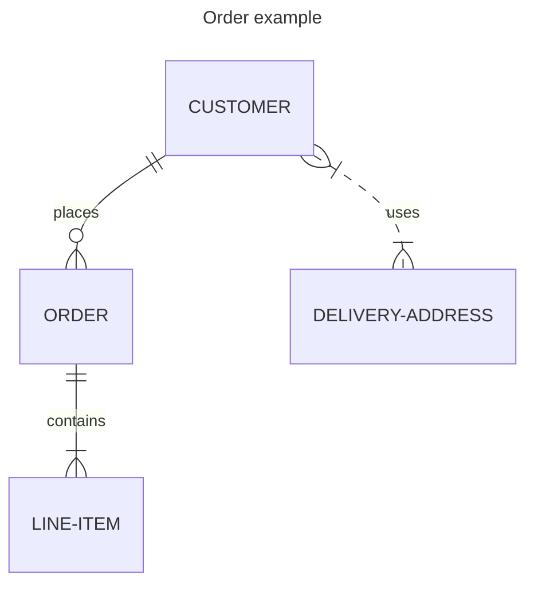

# test-mermaid

```mermaid
sequenceDiagram
    participant ผู้ใช้
    participant ส่วนหน้า (Frontend)
    participant FacebookAPI
    participant ส่วนหลัง (Backend)

    ผู้ใช้->>ส่วนหน้า (Frontend): คลิก "เข้าสู่ระบบด้วย Facebook"
    ส่วนหน้า (Frontend)->>FacebookAPI: เปลี่ยนเส้นทางไปยังหน้าเข้าสู่ระบบ Facebook
    FacebookAPI-->>ผู้ใช้: แสดงหน้าเข้าสู่ระบบ Facebook
    ผู้ใช้->>FacebookAPI: กรอกข้อมูลบัญชีและส่งข้อมูล
    FacebookAPI-->>ส่วนหน้า (Frontend): ส่งรหัสอนุญาต (Authorization Code)
    ส่วนหน้า (Frontend)->>ส่วนหลัง (Backend): ส่งรหัสอนุญาต
    ส่วนหลัง (Backend)->>FacebookAPI: ตรวจสอบรหัสและขอข้อมูลผู้ใช้
    FacebookAPI-->>ส่วนหลัง (Backend): ส่งข้อมูลผู้ใช้กลับมา
    ส่วนหลัง (Backend)-->>ส่วนหน้า (Frontend): ส่งโทเค็นหรือสถานะการเข้าสู่ระบบ
    ส่วนหน้า (Frontend)-->>ผู้ใช้: แสดงข้อความ "เข้าสู่ระบบสำเร็จ"
```

```mermaid
timeline
    title History of Social Media Platform
    2002 : LinkedIn
    2004 : Facebook
         : Google
    2005 : Youtube
    2006 : Twitter
```

```mermaid
classDiagram
    class Class01
    class Class02
    callback Class01 "callbackFunction" "Callback tooltip"
    link Class02 "https://www.github.com" "This is a link"
    class Class03
    class Class04
    click Class03 call callbackFunction() "Callback tooltip"
    click Class04 href "https://www.github.com" "This is a link"
```

```mermaid
---
title: Animal example
---
classDiagram
    note "From Duck till Zebra"
    Animal <|-- Duck
    note for Duck "can fly\ncan swim\ncan dive\ncan help in debugging"
    Animal <|-- Fish
    Animal <|-- Zebra
    Animal : +int age
    Animal : +String gender
    Animal: +isMammal()
    Animal: +mate()
    class Duck{
        +String beakColor
        +swim()
        +quack()
    }
    class Fish{
        -int sizeInFeet
        -canEat()
    }
    class Zebra{
        +bool is_wild
        +run()
    }

```

```mermaid
graph TD;
    A-->B;
    A-->C;
    B-->D;
    C-->D;
```

```mermaid
flowchart TD
    A[Start] --> B{Is it?}
    B -- Yes --> C[OK]
    C --> D[Rethink]
    D --> B
    B -- No ----> E[End]
```

```mermaid
sequenceDiagram
    Alice->>Bob: Hello Bob, how are you ?
    Bob->>Alice: Fine, thank you. And you?
    create participant Carl
    Alice->>Carl: Hi Carl!
    create actor D as Donald
    Carl->>D: Hi!
    destroy Carl
    Alice-xCarl: We are too many
    destroy Bob
    Bob->>Alice: I agree
```

```mermaid
stateDiagram
    [*] --> Still
    Still --> [*]

    Still --> Moving
    Moving --> Still
    Moving --> Crash
    Crash --> [*]
```

```mermaid
---
title: Order example
---
erDiagram
    CUSTOMER ||--o{ ORDER : places
    ORDER ||--|{ LINE-ITEM : contains
    CUSTOMER }|..|{ DELIVERY-ADDRESS : uses
```
